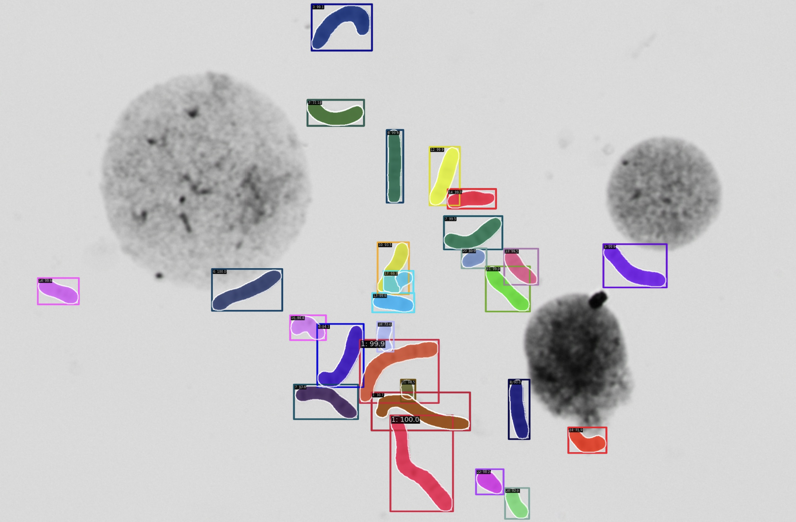

# Chromosome Instance Segmentation with Cascade Mask R-CNN
This project uses **Cascade Mask R-CNN** for instance segmentation of metaphase chromosomes based on the **KaryoNet** dataset.


## Environment
Clone this repo and build the environment. Please follow the official [MMDetection installation guide](https://mmdetection.readthedocs.io/en/latest/get_started.html) to set up. Create a virtual-env Python environment to avoid version conflicts.[Conda](https://docs.conda.io/projects/miniconda/en/latest/) is reconmmended.

```bash
git clone https://github.com/zoeyzhangzz/chromosome-instance-segmentation.git
cd chromosome-instance-segmentation
conda create -n chrom_seg python=3.9 
```

## Train
### Data Preparation
The dataset used in this project is [AutoKary2022](https://github.com/wangjuncongyu/chromosome-instance-segmentation-dataset).Chick here to download.

Place your raw training and validation images and annotations in the following directory structure
```bash
mmdetection/
└── data/
    └── coco/
        ├── train2017/              # Raw training images
        ├── val2017/                # Raw validation images
        └── annotations/
            ├── train/              # Training annotation files 
            └── val/                # Validation annotation files 
```

### Model Configuration
Modify the file under mmdetection/configs/cascade_rcnn to match dataset and training setup
num_classes = 22 categories number + 1 =23

###  Trian the model

```bash
python tools/train.py  configs/cascade_rcnn_r50_fpn_1x.py
```

###  Evaluation

## Cite & Acknowledgements

```
@article{liu2023autokary,
  author    = {Liu, Chuanqi and Hu, Xianxu and Li, Jiazhao and He, Dongrui and Song, Shuai and Sun, Zhenan},
  title     = {{AutoKary2022}: A Large-Scale Densely Annotated Dataset for Chromosome Instance Segmentation},
  journal   = {IEEE Transactions on Medical Imaging},
  year      = {2023},
  doi       = {10.1109/TMI.2023.3241234}
}

@article{cai2019cascade,
  author    = {Cai, Zhaowei and Vasconcelos, Nuno},
  title     = {Cascade R-CNN: High Quality Object Detection and Instance Segmentation},
  journal   = {IEEE Transactions on Pattern Analysis and Machine Intelligence},
  year      = {2019},
  volume    = {43},
  number    = {5},
  pages     = {1483--1498},
  doi       = {10.1109/TPAMI.2019.2908669}
}
```

The implementation is based on the Cascade R-CNN framework and utilizes the AutoKary2022 dataset.Thank theses authors for their contributions to the community.
